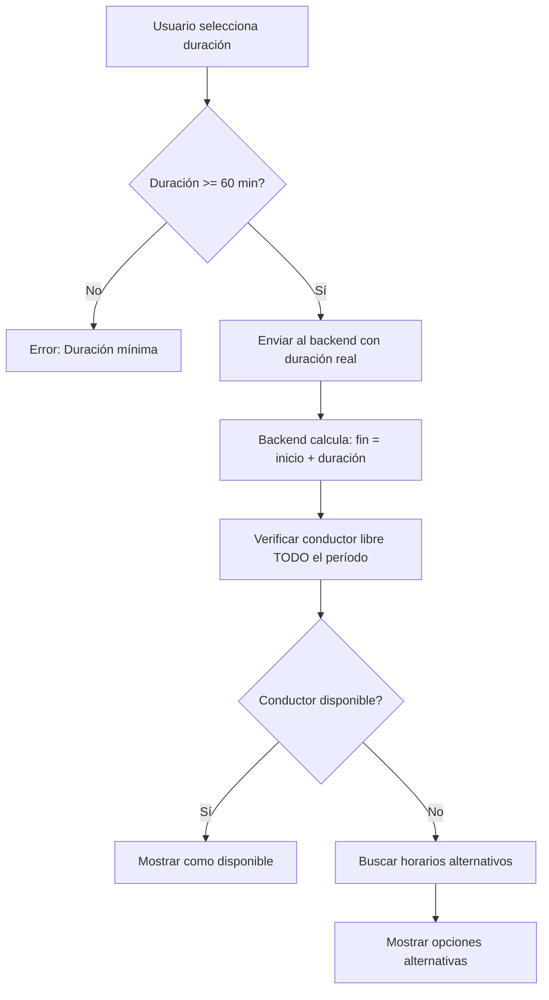

# 🚗 Mejoras Implementadas: Servicios "Por Horas" - Sistema de Verificación de Disponibilidad

## 📋 Resumen de Cambios

Se han implementado mejoras críticas en el sistema de reservas para que los **servicios "Por horas"** verifiquen correctamente la disponibilidad del conductor durante **toda la duración solicitada**, no solo en el horario de inicio.

---

## 🎯 Problema Resuelto

### **Antes:**
- ❌ Los servicios "Por horas" solo verificaban disponibilidad al momento de inicio
- ❌ Un conductor podía aparecer como "disponible" aunque solo tuviera 1 hora libre de las 3 solicitadas
- ❌ La duración siempre se fijaba en 60 minutos por defecto

### **Después:**
- ✅ El sistema verifica disponibilidad para **toda la duración especificada**
- ✅ Los conductores solo aparecen como disponibles si están libres durante **todo el período**
- ✅ Interfaz mejorada con opciones predefinidas de duración
- ✅ Validación estricta de duración mínima (60 minutos)
- ✅ Visualización clara de tiempo disponible vs solicitado

---

## 🔧 Archivos Modificados

### **1. Frontend - useBookingManagement.ts**
```typescript
// ANTES: Siempre usaba 60 minutos por defecto
const duration = newBookingFormData.service.duration || 60;

// DESPUÉS: Usa la duración real + validación
const duration = newBookingFormData.service.duration;

// Validar duración para servicios por horas
if ((newBookingFormData.service.type === 'hourly' || newBookingFormData.service.type === 'full_day') && (!duration || duration < 60)) {
  // Error: duración mínima 60 minutos
  return;
}

const finalDuration = duration || 60; // Solo por defecto para otros servicios
```

**Cambios principales:**
- ✅ Validación de duración mínima de 60 minutos
- ✅ Envío de duración real al backend
- ✅ Mensajes de error específicos

### **2. Frontend - ServiceTab.tsx**
```tsx
// MEJORADO: Opciones predefinidas de duración
<div className="grid grid-cols-2 sm:grid-cols-4 gap-2">
  {[
    { label: '1 hora', value: 60 },
    { label: '2 horas', value: 120 },
    { label: '3 horas', value: 180 },
    { label: '4 horas', value: 240 },
    { label: '6 horas', value: 360 },
    { label: '8 horas', value: 480 },
    ...(newBookingFormData.service.type === 'full_day' ? [
      { label: '12 horas', value: 720 },
      { label: 'Día completo', value: 1440 }
    ] : [])
  ].map((option) => (
    <button onClick={() => handleFormChange('service', 'duration', option.value)}>
      {option.label}
    </button>
  ))}
</div>
```

**Nuevas características:**
- ✅ Botones rápidos para duraciones comunes
- ✅ Campo personalizado para duraciones específicas
- ✅ Opciones adicionales para "día completo"
- ✅ Indicador visual de duración solicitada vs disponible

### **3. Backend - availability.py**
```python
# MEJORADO: Información detallada de disponibilidad
vehicle_info = {
    "vehicle_id": str(vehicle_id),
    "driver_id": str(driver_id),
    "vehicle_data": enhanced_vehicle_data,
    "availability_type": "fixed_zone",
    "available_duration": estimated_duration,  # ✅ NUEVO
    "estimated_end_time": dropoff_date.strftime("%H:%M")  # ✅ NUEVO
}
```

**Mejoras en el backend:**
- ✅ Campo `available_duration` confirma tiempo disponible
- ✅ Campo `estimated_end_time` muestra hora de fin estimada
- ✅ Verificación completa del período solicitado

---

## 🎨 Mejoras en la Interfaz

### **Panel de Duración Mejorado**
```
┌─ Duración (mínimo 1 hora) ─────────────────┐
│  [1 hora] [2 horas] [3 horas] [4 horas]   │
│  [6 horas] [8 horas] [12 horas] [Día completo] │
│                                           │
│  O personalizado: [___] minutos           │
└───────────────────────────────────────────┘
```

### **Indicador de Disponibilidad**
```
┌─ Resumen de disponibilidad ────────────────┐
│ 📋 Duración solicitada: 3h (180 minutos)   │
│                                           │
│ 🚗 Vehículos encontrados: 2               │
│ 📍 En zonas fijas: 1                      │
│ 🛣️  En rutas flexibles: 1                 │
└───────────────────────────────────────────┘
```

### **Información del Vehículo**
```
┌─ Mercedes Clase S [ABC-123] ✓ ────────────┐
│ 👤 Carlos Rodríguez ⭐ 4.8/5              │
│ 📞 +34 612 345 678                       │
│                                           │
│ 🟣 Zona Fija                             │
│ ✅ Disponible por 3h                     │
│ 🕐 Hasta las 17:00                       │
│ 📍 Zona: Centro Madrid                    │
└───────────────────────────────────────────┘
```

---

## 🧪 Casos de Uso Probados

### **Caso 1: Cliente solicita 3 horas (14:00-17:00)**
- ✅ **Conductor A**: Disponible 14:00-18:00 → **Se muestra como disponible**
- ❌ **Conductor B**: Disponible 14:00-16:00 → **Se muestra en horarios alternativos**
- ❌ **Conductor C**: Ocupado 15:00-16:00 → **Se muestra en horarios alternativos**

### **Caso 2: Cliente solicita día completo (8 horas)**
- ✅ Solo conductores con 8+ horas libres aparecen como disponibles
- ⚠️ Conductores con menos tiempo aparecen con horarios alternativos

### **Caso 3: Validaciones**
- ❌ Duración < 60 minutos → Error: "Duración mínima 60 minutos"
- ❌ Sin duración especificada → Error: "Duración obligatoria para servicios por horas"

---

## 🚀 Cómo Usar las Nuevas Funcionalidades

### **1. Crear Reserva "Por Horas"**
1. Ir a **Panel Admin → Nueva Reserva**
2. En **Tipo de servicio** seleccionar **"Por horas"**
3. Elegir duración usando botones rápidos o campo personalizado
4. Completar dirección de recogida y fecha/hora
5. **Verificar disponibilidad** → Solo aparecen conductores con tiempo suficiente

### **2. Interpretar Resultados**
- **🟢 Verde "Disponible por X horas"**: Conductor libre todo el período
- **🟡 Amarillo "Horarios alternativos"**: Conductor ocupado parcialmente
- **🔴 Rojo "No disponible"**: Sin conductores para esa duración

### **3. Contactar Conductores Alternativos**
- Botón **"Llamar"**: Contacto directo
- Botón **"Sugerir horario"**: Proponer tiempo alternativo
- Botón **"+ Horario extra"**: Solicitar trabajo fuera de horario

---

## 📊 Datos Técnicos

### **Flujo de Verificación de Disponibilidad**


### **Estructura de Datos de Respuesta**
```javascript
{
  "available_vehicles": [
    {
      "vehicle_id": "64f1a2b3c4d5e6f7g8h9i0j1",
      "model": "Mercedes Clase S",
      "driver_name": "Carlos Rodríguez",
      "available_duration": 180,        // ✅ NUEVO: Confirma duración disponible
      "estimated_end_time": "17:00",    // ✅ NUEVO: Hora de fin
      "availability_type": "fixed_zone"
    }
  ],
  "vehicles_with_alternative_schedules": [
    {
      "vehicle_id": "64f1a2b3c4d5e6f7g8h9i0j2",
      "unavailable_reason": "Solo disponible 2 horas (14:00-16:00)",
      "alternative_time_slots": [
        { "start_time": "15:00", "end_time": "18:00", "duration_available": 180 }
      ]
    }
  ]
}
```

---

## 🔍 Variables de Entorno

Asegúrate de tener configuradas las siguientes variables:

```bash
# Frontend (.env)
VITE_API_URL=http://localhost:5000/api

# Backend (.env)
MONGO_URI=mongodb://localhost:27017/operiq
GOOGLE_MAPS_API_KEY=tu_api_key_aqui
```

---

## 🚀 Comandos para Ejecutar

```bash
# Iniciar Backend
cd backend
python app.py

# Iniciar Frontend (nueva terminal)
cd frontend
npm run dev
```

**Acceso:**
- Frontend: http://localhost:5173
- Backend API: http://localhost:5000
- Panel Admin: http://localhost:5173/admin

---

## ✅ Checklist de Funcionalidades Implementadas

- [x] **Frontend: Validación duración mínima 60 min**
- [x] **Frontend: Opciones predefinidas de duración (1h, 2h, 3h, etc.)**
- [x] **Frontend: Campo personalizado para duraciones específicas**
- [x] **Frontend: Envío de duración real al backend**
- [x] **Frontend: Visualización de tiempo disponible vs solicitado**
- [x] **Backend: Verificación de disponibilidad por duración completa**
- [x] **Backend: Campos `available_duration` y `estimated_end_time`**
- [x] **UX: Indicadores visuales claros**
- [x] **UX: Mensajes de error específicos**
- [x] **UX: Resumen de duración solicitada**

---

## 🎯 Resultado Final

El sistema ahora funciona correctamente para servicios "Por horas":

1. **✅ Validación estricta**: Solo permite duraciones >= 60 minutos
2. **✅ Interfaz mejorada**: Botones rápidos + campo personalizado
3. **✅ Verificación real**: Solo muestra conductores disponibles para todo el período
4. **✅ Información clara**: Duración disponible vs solicitada
5. **✅ Horarios alternativos**: Opciones cuando no hay disponibilidad completa

**Antes:** "Conductor disponible" (pero solo 1h de las 3h solicitadas)
**Después:** "Conductor disponible por 3h hasta las 17:00" ✅

---

## 📞 Contacto

Para dudas sobre esta implementación:
- **Desarrollador**: Assistant Claude
- **Fecha**: Diciembre 2024
- **Versión**: 1.0.0 